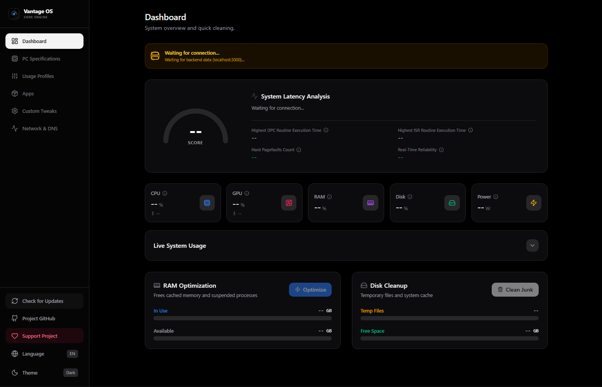

# Vantage OS - Core Engine

> Introducing the brand new Vantage OS, featuring an upgraded native interface and advanced telemetry tools. The next major update is just around the corner!

**Author:** **Alyson** · [github.com/Alyson256](https://github.com/Alyson256) 
**License:** MIT License | Licença MIT  
**Language:**  [PT-BR](./src/assets/docs/pt-br.md)  

---

## General

Vantage OS is not just a cleaning script. It is a low-level telemetry and optimization dashboard featuring a next-generation native interface, designed to monitor hardware in real-time (CPU, GPU, DPC Latency) and apply surgical optimizations without system overhead.

*Note: The UI/UX foundation was initially accelerated utilizing AI tools for rapid prototyping. The project has since transitioned to a fully native C#/.NET architecture, ensuring a premium visual experience with absolute focus on the core engine's performance and low-level system integrations.*

## Key Features
- **Real-Time Telemetry:** Monitor usage, temperature, and power consumption.
- **Latency Analysis:** Track DPC and ISR to ensure zero FPS drops in real-time tasks.
- **One-Click Optimization:** Safely clean RAM cache and system junk.
- **Native Modern UI/UX:** Clean, performance-focused desktop design built with XAML, featuring native Dark Mode support.

## Project Status: Active Development
**Current Phase:** Native UI/UX Migration & Backend Integration

The visual foundation has been completely migrated to a C#/.NET stack (WPF/WinUI 3). I am currently running a sprint focused on stability and seamless integration between the new XAML frontend and the hardware telemetry backend.

- **Hotfixes:** Structuring the MVVM (Model-View-ViewModel) architecture, optimizing XAML data bindings for high-frequency telemetry updates, and isolating data states.
- **Code Cleanup:** Stripping legacy web dependencies (React/HTML/CSS) to ensure a strictly lightweight, low-overhead native desktop experience.
- **Up Next:** Binding the C# frontend directly to the local C/Python core engine to feed the real-time telemetry stream.