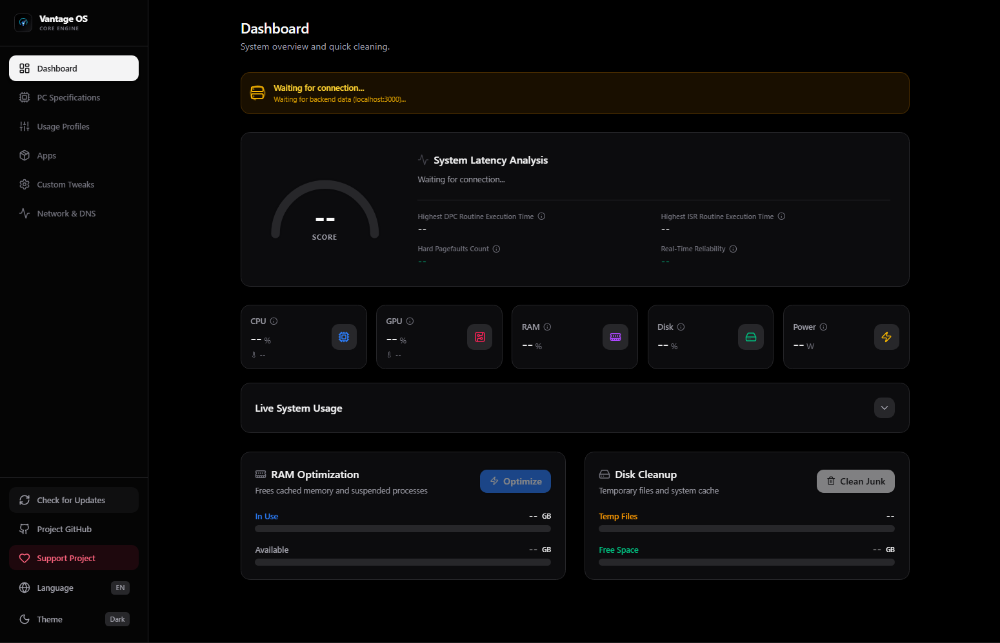

# Vantage OS - Core Engine

> Dashboard de telemetria de baixo nível e otimização para Windows 11 — seguro, documentado e totalmente reversível.

**Autor:** **Alyson** · [github.com/Alyson256](https://github.com/Alyson256)  
**Licença:** MIT License | Licença MIT  
**Documentação:** [EN](../../../README.md) | PT-BR  

---

## Geral

O Vantage OS não é só um script de limpeza. É um dashboard de telemetria e otimização de baixo nível, feito pra monitorar o hardware em tempo real (CPU, GPU, Latência DPC/ISR) e aplicar otimizações cirúrgicas sem adicionar sobrecarga própria ao sistema.

> Nota: A base de UI/UX foi prototipada rapidamente em React com apoio de ferramentas de IA, o que permitiu iteração rápida sobre o design visual e a estrutura dos componentes. Esse protótipo está sendo migrado para uma implementação nativa em WPF/WinUI 3 (C#) — um otimizador de sistema não tem motivo pra competir pelos próprios recursos que existe pra liberar, então o app final roda sem nenhum motor de navegador embutido e com consumo mínimo de memória.

# Principais Funcionalidades
Telemetria em Tempo Real — Monitora uso de CPU/GPU, temperatura e consumo de energia ao vivo.
Análise de Latência — Rastreia o tempo de execução de DPC e ISR pra identificar o que está causando queda de frames ou falhas de áudio em tarefas de tempo real.
Otimização em Um Clique — Libera cache de RAM e limpa arquivos temporários do sistema com segurança.
Interface Nativa e Moderna — Design de desktop limpo e focado em performance (WPF/WinUI 3), com suporte nativo a Modo Escuro — sem nenhum motor de renderização web envolvido.
Stack Tecnológica
Interface: WPF / WinUI 3 (C#, .NET) — nativa, sem motor de navegador
Motor Principal: C# — WMI, Registro e ETW pra telemetria em tempo real e ajustes de sistema
Armazenamento: SQLite — embutido, sem dependências externas
Prototipagem: React — usado só na fase inicial de exploração de UI/UX, não faz parte do app final
Status do Projeto: Em Desenvolvimento Ativo

# Fase Atual: Migração de Arquitetura — Protótipo em React → WPF/WinUI 3 Nativo

O design visual já está validado, e no momento estou portando a interface do protótipo original em React pra uma implementação nativa em XAML, além de construir o motor de telemetria diretamente em C#. Isso elimina de vez a camada de servidor local / WebSocket — a telemetria é lida no mesmo processo, sem nenhum salto de rede entre "frontend" e "backend".

* Em andamento: Migração dos componentes de UI do protótipo React pra views nativas em XAML.
* Em andamento: Implementação de acesso direto via WMI / Registro / ETW pra telemetria em tempo real, substituindo a antiga dependência do ws://localhost:3000.
* Próximos passos: Integração de um banco de dados SQLite local pra perfis de uso, ajustes personalizados e histórico de feedback.
* Próximos passos: Criação automática de ponto de restauração do Windows antes de qualquer otimização em lote, como rede de segurança.
